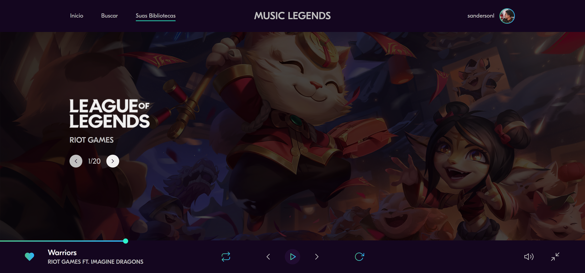

<h1 align="center">
  Music Legends
</h1>

  
  
  
  
  

  
  
  

  

## 💻 Projeto
O protótipo desse website foi desenvolvido pelo [**Iuri Silva**](https://www.instagram.com/iuricode/), [clique aqui](https://www.figma.com/file/Yb9IBH56g7T1hdIyZ3BMNO?node-id=80254%3A868) para abrir o protótipo no figma.

### Dependências

-  HTML
-  CSS
-  JavaScript
-  SVG Inject